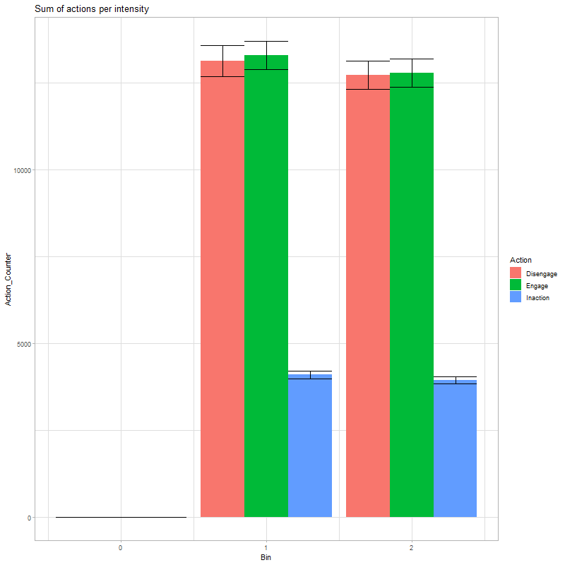

```{r setup, include=FALSE}
knitr::opts_chunk$set(echo = TRUE)
```

This is to confirm that for `MAX_OCCURENCE = 1` there is no interaction effect between engagement and stimulus intensity. It also confirms that the advantage of engagement disappears, as with only 1 occurrence there is no time for an adaptation effect to play out.

```
SEED = [1:30]
N_RUNS = 60000
N_STIMULI = 300
N_ACTIONS = 3
N_STATES = 3
STIMULUS_MAX_OCCURRENCE = 1
STIMULUS_INT_MIN = 1
STIMULUS_INT_MAX = 10
DECAY_TIME = N_RUNS * .7    # How much of the total run is used for exploring

alpha = 0.1
gamma = 0.99
epsilon = 1
DECAY_FACTOR = epsilon/DECAY_TIME  # how much epsilon is lowered each step

disengage_benefit = 2
engage_adaptation = 2
engage_benefit = 2
adaptation_generalization = 1
```

