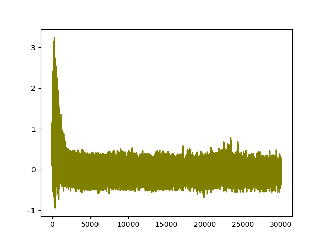
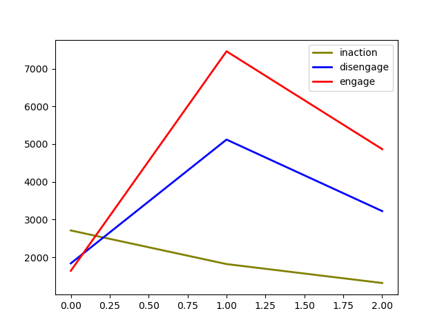
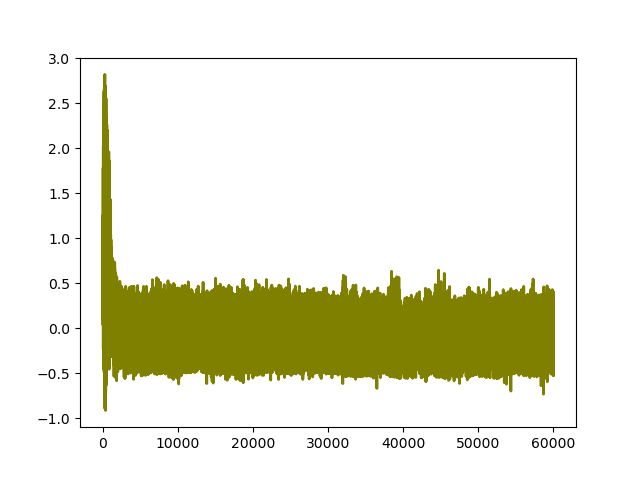
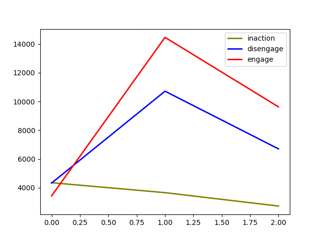
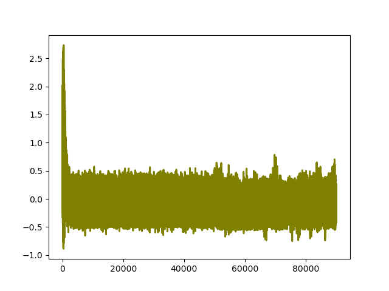
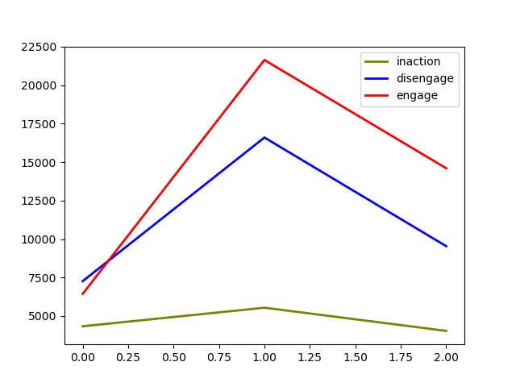
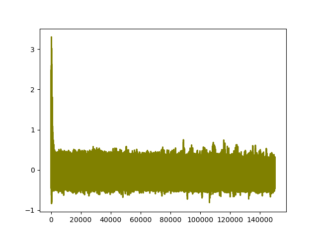
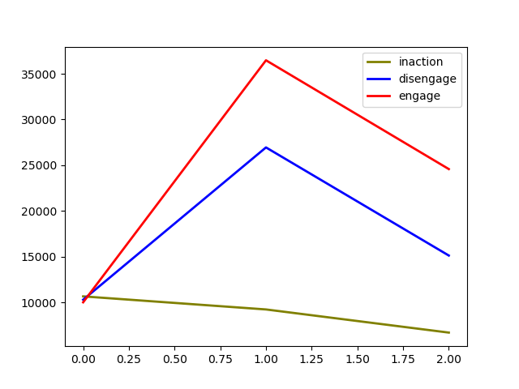
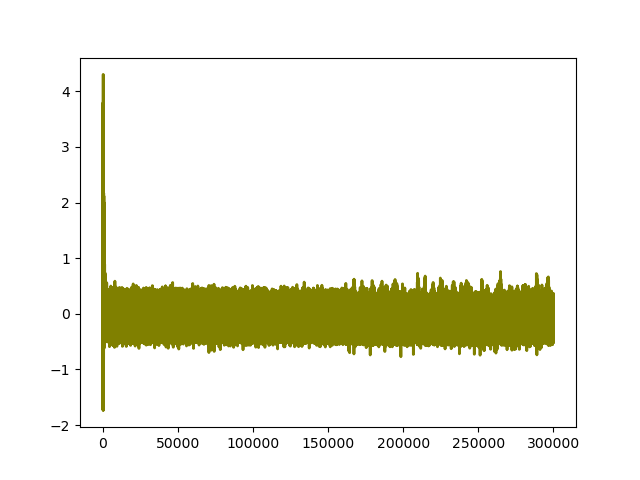
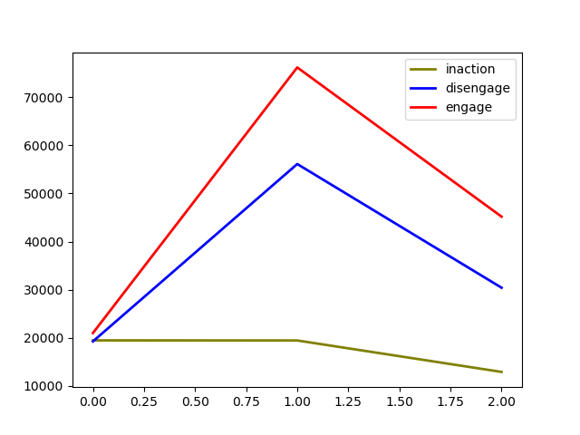

```{r setup, include=FALSE}
knitr::opts_chunk$set(echo = TRUE)
```

## Introduction

In this simulation I investigated how we can determine if the algorithm has converged to the optimal solution. It appears that there is no general answer to this problem. In qLearning, there is often a decay factor for the learning rate (alpha). It is then given that the algorithm has converged when alpha = 0. However, this simply turns the problem around to the question of which parameters for alpha and its decay rate lead to convergence to the optimal solution.

Another solution that is often suggested is setting a threshold for the size of the change that results from each update. If the values change by e.g., less than .0001 each iteration, the qTable could be considered converged. This, however, only works for deterministic environments. Our environment is stochastic, however, in that the future reward depends on the next stimulus that is sampled. The values thus continue to change, as also becomes clear from the simulation.


## qTable Values

This simulation shows the final learned qTable of the agent after a different number of runs. This is to get some idea of how the values change as time goes on. To me it seems that the qTable does not converge to certain values, but continues to move around within a certain range. 

```
SEED = 123
N_RUNS = [30000, 60000, 90000, 150000]
N_STIMULI = 300
N_ACTIONS = 3
N_STATES = 3
STIMULUS_INT_MIN = 1
STIMULUS_INT_MAX = 10
DECAY_TIME = N_RUNS * .7    # How much of the total run is used for exploring

alpha = 0.1
gamma = 0.9
epsilon = 1
DECAY_FACTOR = epsilon/DECAY_TIME  # how much epsilon is lowered each step

disengage_benefit = 3
engage_benefit = 3
engage_adaptation = 2
```


### N_RUNS = 30000

```
    inaction  disengage     engage
0  90.118697  88.995682  88.889921
1  86.400690  88.005520  89.506346
2  82.030231  85.581608  84.440828

```


### N_RUNS = 60000

```
    inaction  disengage     engage
0  83.015660  83.860562  82.998613
1  79.842193  83.156052  82.541124
2  76.332232  78.270110  77.749103
```

### N_RUNS = 90000

```
    inaction  disengage     engage
0  85.477335  87.330589  87.196848
1  84.799247  85.819352  86.934228
2  78.898703  82.416091  83.697086
```


### N_RUNS = 150000

```
    inaction  disengage     engage
0  86.133337  86.483513  87.012457
1  84.894551  86.728690  84.706289
2  80.640362  81.291309  83.313192
```


## Update Amount

This simulation shows how the value by which the qTable is updated each iteration changes over time. This is calculated as the sum of the qTable at time step t, minus the sum of the qTable at time step t-1. If the qTable would approach a certain value, we would expect this updating value to become smaller over time. It does initially become smaller indeed, but then it continues to fluctuate within certain boundaries.

```
SEED = 123
N_RUNS = [30000, 60000, 90000, 150000, 300000]
N_STIMULI = 300
N_ACTIONS = 3
N_STATES = 3
STIMULUS_INT_MIN = 1
STIMULUS_INT_MAX = 10
DECAY_TIME = N_RUNS * .7    # How much of the total run is used for exploring

alpha = 0.1
gamma = 0.9
epsilon = 1
DECAY_FACTOR = epsilon/DECAY_TIME  # how much epsilon is lowered each step

disengage_benefit = 3
engage_benefit = 3
engage_adaptation = 2
```


### N_RUNS = 30000





### N_RUNS = 60000






### N_RUNS = 90000






### N_RUNS = 150000






### N_RUNS = 300000




## Cutting off after initial learning


### N_RUNS = 30000


### N_RUNS = 60000


### N_RUNS = 90000


### N_RUNS = 150000


### N_RUNS = 300000


