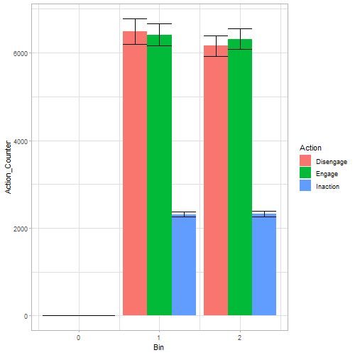
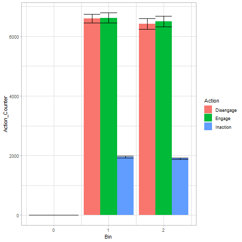
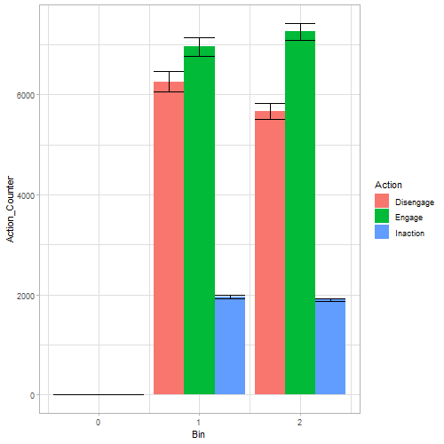
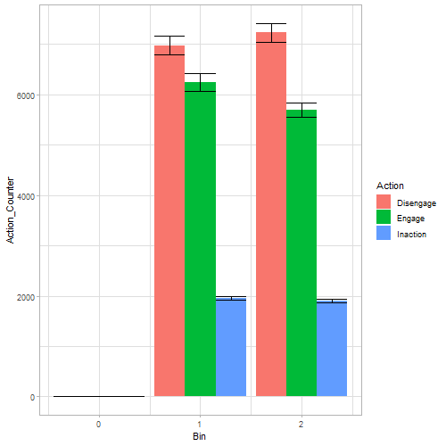
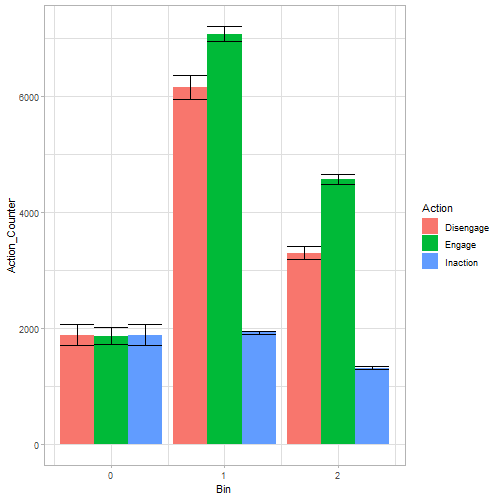

```{r setup, include=FALSE}
knitr::opts_chunk$set(echo = TRUE)
```

## Introduction

In this simulation I investigated whether the long term benefit of engagement is correctly assigned, given the changes to the model we discussed. Spoiler: This seems to be the case. First, I will recap the changes made to the model. Then I will discuss simulation studies that led me to the conclusion that the long term benefit **does** work now.


### Bins

The model now bins the intensity values into 3 bins: 0, 1, 2. I think the function for this describes this very clearly:

```
if value > 5:
  return 2
elif value > 0:
  return 1
else:
  return 0
```

I have made an extra bin for 0, because I noticed that the 0s were biasing the results for the low intensities (= bin 1),
when using only 2 bins. The differences between actions were less clear with the 0s in the low intensity bin. Note that bin 0 is empty when `engage_adpatation = 0`, since the values don't change through adaptation and no stimuli are initialized with intensity
0.

### Decay Factor

I have changed the rewards to positive values instead of negative values. This made the learning take much longer and often
converge to a random action, when epsilon was too low. However, if epsilon was too high the model did not converge as clearly
onto one action. Thus, I have implemented a decay factor. Epsilon starts at 1 and is reduced to .1 over the course of the simulation. The parameters that could be discussed here are the rest value of epsilon (I have opted for .1 to allow some randomness) and how quickly the decay should take place (currently equally spread out over 70% of the total runtime). 

### Do not allow repeated sampling of same stimulus

To test our hypotheses regarding the reward assignment of `engage_adaptation`, I have set the environment to never sample the same stimulus twice in a row.


## Benefits Equal

In these simulations, `engage_benefit` and `disengage_benefit` are set to be equal, while `engage_adaptation` is deactivated. This is to confirm that the agent does not prefer either of the actions for any reason I might have overlooked. The `engage_benefit` and `disengage_benefit` are set to 1, 3 and 5, to confirm this for all intensities. Every simulation is repeated 30 times with a different seed.

The results confirm that neither action is preferred for any intensity. The tables report the mean values taken from the
30 repetitions. As you can see, there is no difference in how often engagement and disengagement were selected per intensity.

```
SEED = 1:30
N_RUNS = 30000
N_STIMULI = 300
N_ACTIONS = 3
N_STATES = 3
STIMULUS_INT_MIN = 1
STIMULUS_INT_MAX = 10
DECAY_TIME = N_RUNS * .7    # How much of the total run is used for exploring

alpha = 0.1
gamma = 0.9
epsilon = 1
DECAY_FACTOR = epsilon/DECAY_TIME  # how much epsilon is lowered each step

disengage_benefit = [1, 3, 5]
engage_adaptation = 0
engage_benefit = disengage_benefit
```

### engage_and_disenage_benefit = 1

```{r echo=FALSE}
knitr::kable(data.frame(Intensity = c("Zero", "Low", "High"),
                        Inaction = c(0, "2315 [31.2]", "2317 [32.04]"),
                        Disengagement = c(0, "6488 [149.2]", "6156 [118.6]"),
                        Engagement = c(0, "6407 [128.2]", "6314 [120.72]")), caption = "Action choosen per intensity, with the Std. Error")
```




### engage_and_disenage_benefit = 3

```{r echo=FALSE}
knitr::kable(data.frame(Intensity = c("Zero", "Low", "High"),
                        Inaction = c(0, "1972 [30]", " 1909 [24.4]"),
                        Disengagement = c(0, "6647 [112.2]", "6545 [144.2]"),
                        Engagement = c(0, "6623 [125.4]", "6303 [93.2]")), caption = "Action choosen per intensity, with the Std. Error")
```


### engage_and_disenage_benefit = 5

```{r echo=FALSE}
knitr::kable(data.frame(Intensity = c("Zero", "Low", "High"),
                        Inaction = c(0, "1953 [25.7]", " 1894 [23.3]"),
                        Disengagement = c(0, "6620 [129.6]", "6668 [126.1]"),
                        Engagement = c(0, "6668 [149.2]", "6194 [123.9]")), caption = "Action choosen per intensity, with the Std. Error")
```


### N_STIMULI = 300

The same holds when the number of stimuli differs. The model thus clearly behaves as expected and does not prefer any action
for unknown reasons, when the benefits are equal.

```
SEED = 1:30
N_RUNS = 30000
N_STIMULI = [300, 600, 1000]
N_ACTIONS = 3
N_STATES = 3
STIMULUS_INT_MIN = 1
STIMULUS_INT_MAX = 10
DECAY_TIME = N_RUNS * .7    # How much of the total run is used for exploring

alpha = 0.1
gamma = 0.9
epsilon = 1
DECAY_FACTOR = epsilon/DECAY_TIME  # how much epsilon is lowered each step

disengage_benefit = 3
engage_adaptation = 0
engage_benefit = disengage_benefit
```


```{r echo=FALSE}
knitr::kable(data.frame(Intensity = c("Zero", "Low", "High"),
                        Inaction = c(0, "1955 [25.92]", "1900 [23.4]"),
                        Disengagement = c(0, "6612 [108.6]", "6575 [143.7]"),
                        Engagement = c(0, "6643 [126.1]", "6313 [94.9]")), caption = "Action choosen per intensity, with the Std. Error")
```


### N_STIMULI = 600

```{r echo=FALSE}
knitr::kable(data.frame(Intensity = c("Zero", "Low", "High"),
                        Inaction = c(0, "1960 [16.7]", " 1899 [15.1]"),
                        Disengagement = c(0, "6598 [71.77]", "6421 [91.61]"),
                        Engagement = c(0, "6620 [88.2]", "6498 [88.8]")), caption = "Action choosen per intensity, with the Std. Error")
```



### N_STIMULI = 1000


```{r echo=FALSE}
knitr::kable(data.frame(Intensity = c("Zero", "Low", "High"),
                        Inaction = c(0, "1957 [16.3]", " 1898 [16.9]"),
                        Disengagement = c(0, "6578 [105.4]", "6497 [89.6]"),
                        Engagement = c(0, "6636 [102.3]", "6431 [88.6]")), caption = "Action choosen per intensity, with the Std. Error")
```


## Small Differences

In these simulations we want to clarify whether to agent reacts to small differences in benefit. This is not to investigate
how small the differences can be, but again to confirm that the model behaves as expected and prefers the better action. `engage_adaptation` is still deactivated, thus only the `_benefit` parameters determine the value of an action. Again, all
simulation are repeated over 30 different seeds and the mean is taken.

The results confirm that the agent learns to prefer the action with the higher benefit, even with a small difference in benefit of 0.1.

```
SEED = 1:30
N_RUNS = 30000
N_STIMULI = 600
N_ACTIONS = 3
N_STATES = 3
STIMULUS_INT_MIN = 1
STIMULUS_INT_MAX = 10
DECAY_TIME = N_RUNS * .7    # How much of the total run is used for exploring

alpha = 0.1
gamma = 0.9
epsilon = 1
DECAY_FACTOR = epsilon/DECAY_TIME  # how much epsilon is lowered each step

disengage_benefit = [3.0, 3.1]
engage_benefit = [3.0, 3.1]
engage_adaptation = 0
```
### disengage_benefit = 3.0, engage_benefit = 3.1

```{r echo=FALSE}
knitr::kable(data.frame(Intensity = c("Zero", "Low", "High"),
                        Inaction = c(0, "1959 [16.8]", " 1898 [15.4]"),
                        Disengagement = c(0, "6256 [103.8]", "5669 [82.1]"),
                        Engagement = c(0, "6958 [97.4]", "7257 [85.9]")), caption = "Action choosen per intensity, with the Std. Error")
```




### disengage_benefit = 3.1, engage_benefit = 3.0


```{r echo=FALSE}
knitr::kable(data.frame(Intensity = c("Zero", "Low", "High"),
                        Inaction = c(0, "1960 [16.8]", " 1899 [15.5]"),
                        Disengagement = c(0, "6972 [94.1]", "7229 [93.6]"),
                        Engagement = c(0, "6240 [92.4]", "5697 [70.9]")), caption = "Action choosen per intensity, with the Std. Error")
```



## With Adaptation

Now it is established that if we are only looking at the `_benefit`, the agent learns to prefer the action with the higher
benefit -- and if both are equal, it chooses them to equal amounts. Thus, if the value of `engage_adaptation` is assigned correctly, if the `_benefits` are equal, we would expect the agent to prefer engagement.

The results show that this is indeed the case. The agent consequently prefers engagement when the `_benefits` are equal, but
`engage_adaptation` is not 0. This cannot be caused by the re-encounter of stimuli directly after engaging - as I proposed
previously - as the model does not allow for a stimulus to be sampled twice in a row. I, therefore, conclude that the benefits
of `engage_adaptation` are correctly assigned and the likely cause for this not working previously was indeed the high number
of time steps and following discounting of these rewards.


```
SEED = 1:30
N_RUNS = 30000
N_STIMULI = 600
N_ACTIONS = 3
N_STATES = 3
STIMULUS_INT_MIN = 1
STIMULUS_INT_MAX = 10
DECAY_TIME = N_RUNS * .7    # How much of the total run is used for exploring

alpha = 0.1
gamma = 0.9
epsilon = 1
DECAY_FACTOR = epsilon/DECAY_TIME  # how much epsilon is lowered each step

disengage_benefit = 3
engage_benefit = 3
engage_adaptation = 2
```

```{r echo=FALSE}
knitr::kable(data.frame(Intensity = c("Zero", "Low", "High"),
                        Inaction = c("1886 [92.0]", "1929 [12.3]", "1322.7 [11.1]"),
                        Disengagement = c("1890 [92.7]", "6154.5 [104.3]", "3301 [55.7]"),
                        Engagement = c("1869 [73.3]", "7074 [66.9]", "4570 [43.4]")), caption = "Action choosen per intensity, with the Std. Error")
```




## Next Steps

### Value of Adaptation

Now that we are confident that `engage_adaptation` does give some reward, we can investigate to which `_benefit` this reward corresponds. To this end, I have thought of a simulation in which `engage_benefit = 0` and `engage_adaptation = 1`. The value of
`disengage_benefit` changes. The value of `disengage_benefit` at which the agent starts to prefer disengagement is an estimate
of the reward from `engage_adaptation`. However, depending on how precise we want to estimate this, this might require many simulations. Thus, I am still thinking about how to estimate this numerically instead of through simulation. 

### Convergence

A next important step is to determine when the model has converged. This is still not entirely clear to me. We could set a threshold at which the qTable values only change by very small amounts. I am not sure, however, that this would work as desired.
First, if we want the whole qTable to converge, also the values of the non-preferred actions would need to converge. However, after a certain learning time, these actions are only chosen epsilon percent of the time. Thus, for these values to converge could take a very long time. Second, I am not entirely sure the qTable has a stable state it converges to. Let's take a look at the
qLearning algorithm:

`self.qtable[state_id, action_id] + self.alpha * (reward + self.gamma * np.max(self.qtable[next_state_id, :]) - self.qtable[state_id, action_id])`

If the `next_state` was stable, the expression `(reward + self.gamma * np.max(self.qtable[next_state_id, :]) - self.qtable[state_id, action_id])`, thus the updated value, would converge to 0. However, since `next_state` is random, the value will sometimes be overestimated and sometimes underestimated, but it will continue to change. This is not relevant for the relationships between the actions, as it should balance out, but I think this prevents the qTable from approaching fixed values.

### Time Function

Now that the benefit of adaptation is established, we can add the differential rewards of `engage_benefit` interacting with
`stimulus_intensity` back. The equation will determine at which intensity engagement is preferred over disengagement. I will run simulations to find the point at which this works out for the 3 bins that are currently implemented. If we are switching back to 10 intensities (= 10 bins), we would need to make a decision where the interaction should take place.

