```{r setup, include=FALSE}
knitr::opts_chunk$set(echo = TRUE)
```

## Introduction

In this simulation I investigated which effects the generalization of the reappraisal adaption to disengagement has. The long-term benefit of engagement comes from the adaptation effect it has on a stimulus. This adaptation effect can either apply only when engagement is used again, or also when disengagement is used. Also partial generalization is conceivable, thus when engagement is used for the 2nd time, the stimulus intensity is `intensity - engage_adaptation` whereas, when a stimulus was engaged with once and then disengagement is used, it would be `intensity - engage_adaptation * X`, where `X` is the partial generalization factor. Another question this report investigates is the effect of stimulus replacement. Previously, the stimuli were hard-coded to be replaced after 5 occurrences. It would be interesting to understand what the effects of faster or slower replacement are.


## Changes to the Code

### Parameter for Adaptation Generalization

I have added a parameter that determines how much of the effect of `engage_adaptation` also carries over when using disengagement.
Previously, this parameter was implicitly set to 1, thus all adaptation effects carried over to all actions. Now, this parameter can be set to any value, but we would probably want to keep it between 0 and 1. 


### Parameter for Stimulus Replacement

I have added a parameter that determines after how many occurrences a stimulus is replaced. Every time a stimulus is sampled, this counts as one occurrence - independent of the chosen action.

## Adaptation Generalization Effects

```
SEED = 123
N_RUNS = 60000
N_STIMULI = 300
N_ACTIONS = 3
N_STATES = 3
STIMULUS_MAX_OCCURRENCE = 5
STIMULUS_INT_MIN = 1
STIMULUS_INT_MAX = 10
DECAY_TIME = N_RUNS * .7    # How much of the total run is used for exploring

alpha = 0.1
gamma = 0.99
epsilon = 1
DECAY_FACTOR = epsilon/DECAY_TIME  # how much epsilon is lowered each step

disengage_benefit = 2
engage_adaptation = 2
engage_benefit = 2
adaptation_generalization = [0, 0.5, 1]
```


In this simulation, we are looking at the effect of generalization in isolation. Remember that before `adaptation_generalization` 
was an explicit parameter, it was implicitly set to 1. The first simulation is thus in line with previous simulations under the given parameter settings. The following simulations show us that setting `adaptation_generalization` to < 1, will increase the advantage that engagement has over disengagement. Note that this is only a brief check, a much more elaborate confirmation of this ,with multiple repetitions, can be found under [Interaction Effects].

### adaptation_generalization = 1

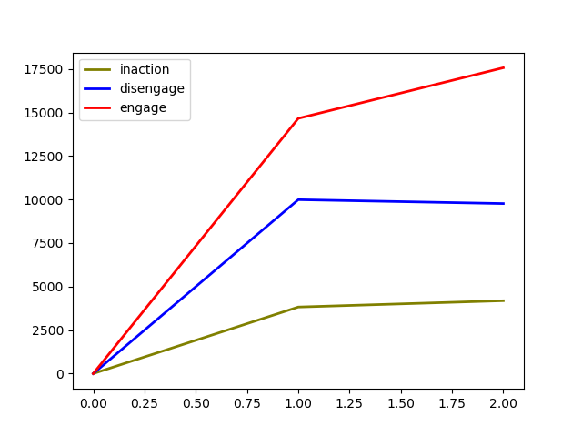


### adaptation_generalization = 0.5

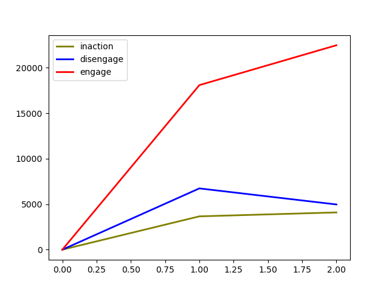

### adaptation_generalization = 0

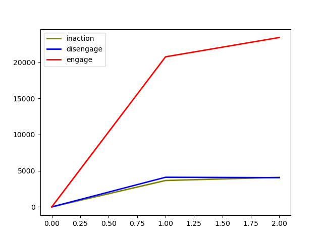

## Replacement Speed Effects

```
SEED = 123
N_RUNS = 60000
N_STIMULI = 300
N_ACTIONS = 3
N_STATES = 3
STIMULUS_MAX_OCCURRENCE = [1, 2, 5, 10, 20]
STIMULUS_INT_MIN = 1
STIMULUS_INT_MAX = 10
DECAY_TIME = N_RUNS * .7    # How much of the total run is used for exploring

alpha = 0.1
gamma = 0.99
epsilon = 1
DECAY_FACTOR = epsilon/DECAY_TIME  # how much epsilon is lowered each step

disengage_benefit = 2
engage_adaptation = 2
engage_benefit = 2
adaptation_generalization = 1
```

In this simulation, we are looking at the effect of replacement speed in isolation. Remember that before `STIMULUS_MAX_OCCURRENCE`
was a variable parameter, it was hard coded to 5. The simulation with `STIMULUS_MAX_OCCURRENCE = 5` is thus in line with previous simulations under the given parameter settings. The following simulations show us that increasing `STIMULUS_MAX_OCCURRENCE` will increase the advantage that engagement has over disengagement and vice versa, altough this appears to reach a maximum rather quickly, at which a slower replacement does not improve engagement any more. Note that this is only a brief check, a much more elaborate confirmation of this, with multiple repetitions, can be found under [Interaction Effects]

### STIMULUS_MAX_OCCURENCE = 1

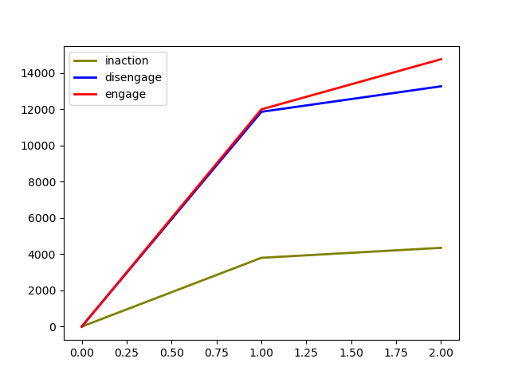

### STIMULUS_MAX_OCCURENCE = 2

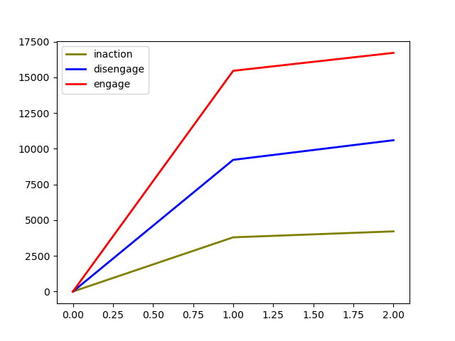

### STIMULUS_MAX_OCCURENCE = 5


### STIMULUS_MAX_OCCURENCE = 10

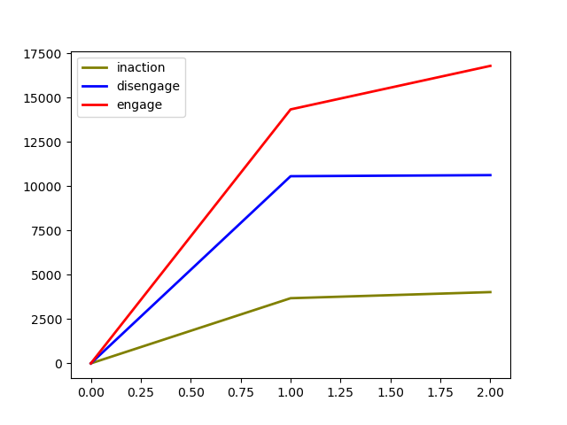

### STIMULUS_MAX_OCCURENCE = 20


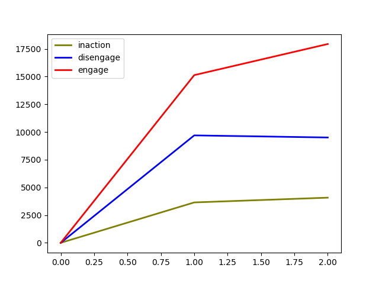


## Interaction Effects

```
SEED = [1:5]
N_RUNS = 60000
N_STIMULI = 300
N_ACTIONS = 3
N_STATES = 3
STIMULUS_MAX_OCCURRENCE = [2, 4, 6, 8, 10]
STIMULUS_INT_MIN = 1
STIMULUS_INT_MAX = 10
DECAY_TIME = N_RUNS * .7    # How much of the total run is used for exploring

alpha = 0.1
gamma = 0.99
epsilon = 1
DECAY_FACTOR = epsilon/DECAY_TIME  # how much epsilon is lowered each step

disengage_benefit = 2
engage_adaptation = 2
engage_benefit = 2
adaptation_generalization = [0, 0.1, 0.2, ..., 0.9, 1]
```

This simulation changes `adaptation_generalization` and `STIMULUS_MAX_OCCURRENCE` simultenously and summarizes the effect of these parameters on the preferred action in a heatmap plot.


### Heatmap explanation

With the current settings, engagement is expected to always be better than disengagement, as the benefits for both are = 2, but engagement also has the long-term adaptive value. To summarize the results of the simulations in a single statistic, I have thus opted for the ratio of engagement:disengagement. For example:

```{r echo=FALSE}
knitr::kable(data.frame(Intensity = c("Zero", "Low", "High"),
                        Inaction = c(0, "3819", "4250"),
                        Disengagement = c(0, "6650", "6686"),
                        Engagement = c(0, "18007", "20588")), caption = "Action choosen per intensity")
```

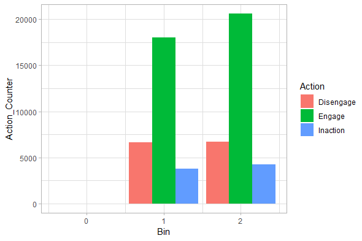

The engagement:disengagement ratio overall is:

```{r}
(18007 + 20588) / (6650 + 6686)
```

For low intensity stimuli:

```{r}
18007 / 6650
```

For high intensity stimuli:

```{r}
20588 / 6686
```


### Heatmap overall

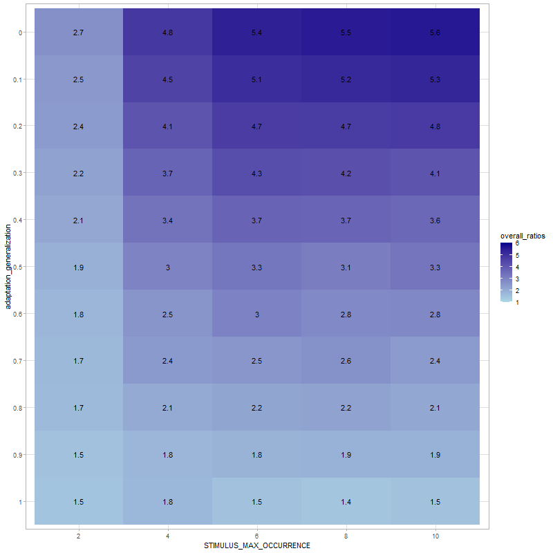


### Heatmap low stimulus intensity

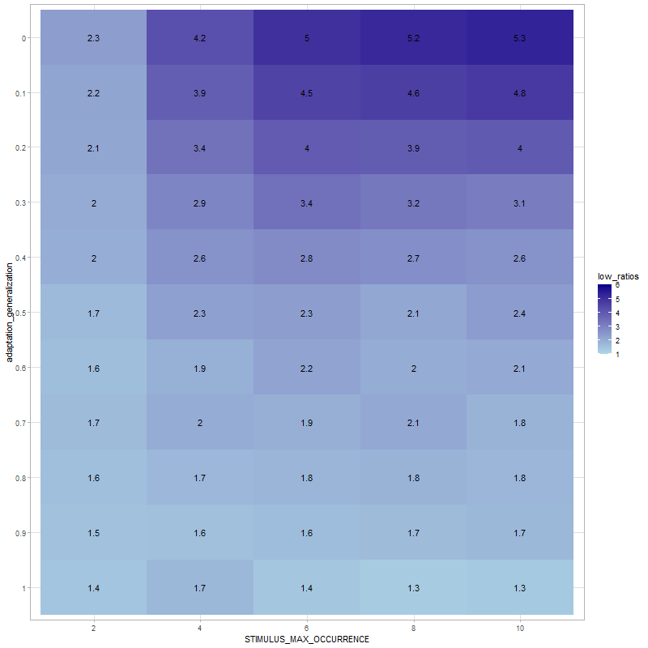

### Heatmap high stimulus intensity

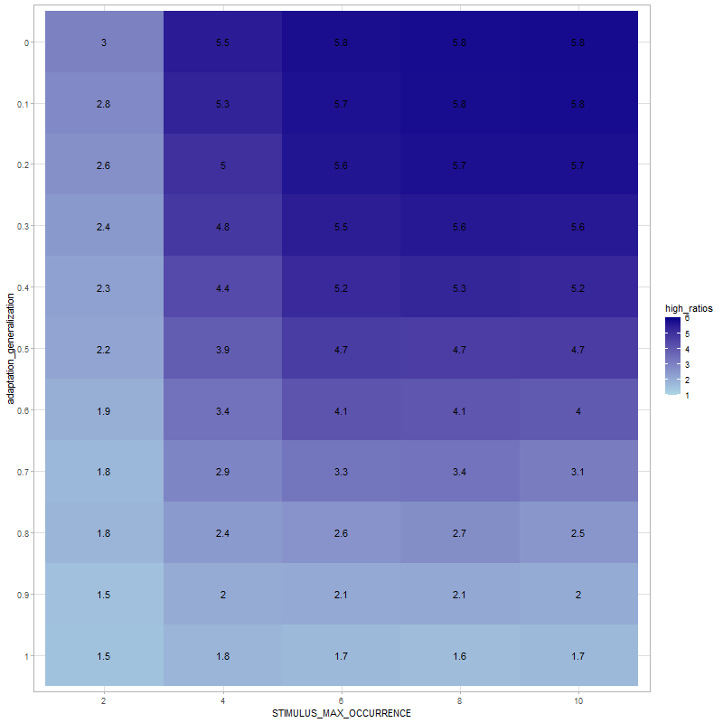

## Conclusion

Higher value for `STIMULUS_MAX_OCCURENCE` improve the performance of engagement, although this appears to reach a ceiling effect rather quickly. Lower values for `adaptation_generalization` also improve the performance of engagement. These two effects are additive.  

## Notes

There were no stimuli in bin 0 anymore, as no stimulus gets "permanently" reduced after the changes I made to the code. This also has implications for the `state`. The `state` is now always the original intensity of a stimulus. There is no way around this, as it would not be possible to have different states per action that is chosen. The state determines which action is selected, thus, it cannot be computed based on the selected action.


